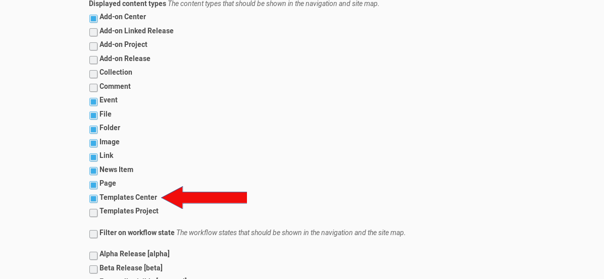
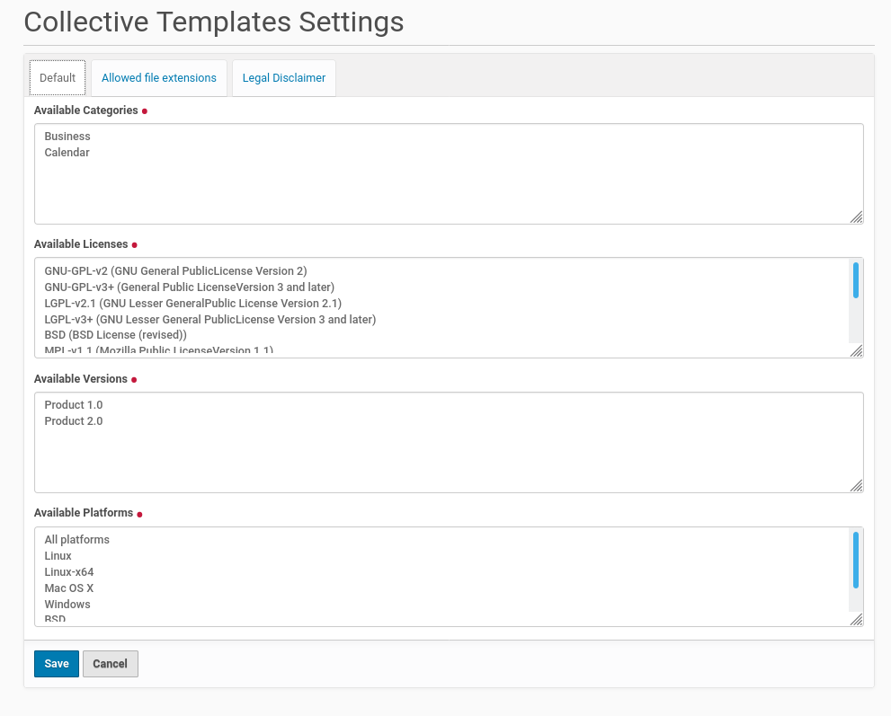
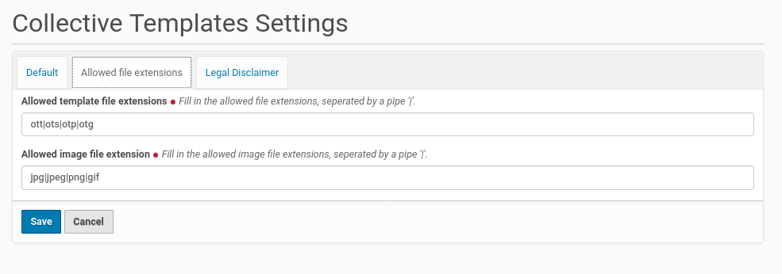
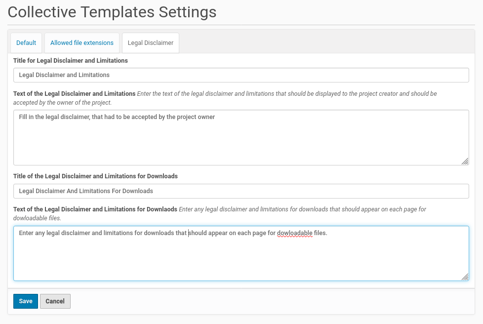

Configuration
=============

The configuration of the add-on could be done from the Plone controlpanel 'Site Setup'.
You already used this panel during the installation of the add-on. There are entries
for different configuration task.

Navigation configuration
************************

Next you need to go to the 'Navigation' configuration inside the 'Site Setup'.
Thus click on the corresponding button and you get to the configuration menu
in the screenshot below.

Tick the checkbox in fron of the entry 'Templates Center' and save your
changes. The necessary steps are done to go to the homepage of your Plone
site (or a subdirectory of the site, where you want to create a new
template center.

Collective Templates Settings
*****************************

Once you finished the modification of navigation settings you could scroll down a bit
on the Site Settings page to the section for 'Add-on Configuration'. There you find a
new entry for this add-on with the title 'Collective Templates Settings'. Click on this
entry and you get a form with fields to configure the add-on.

The fields on the first register 'Default' collect the values for the categories, the licenses, the versions
(the versions of the product, the templates are compatible with) and the platforms. This fields comes already
with some default value. You could replace this values with your own choice. Every single value needs
a new line.

The entries of this fields will be used to configure the available options for the contributors on the
modules to create a template project and choose e.g. a license for it and its files.

The second register ''Allowed file extensions' need your input about the allowed file extensions for the
templates and the image file extensions (logo, screenshot). If there are different file extensions allowed
for this file categories you could enter this file extensions seperated by a pipe into the form
fields, e.g.: 'pdf|odt' for documentation files.

The third register 'Legal Disclaimer' provides fields to configure the title and the text of the legal
disclaimer for contributions and the ones for downloading templates.

Once you finished the configuration within the fields of all three register save your changes.
This will write some new entries to the 'Configuration Registry' of the Plone site. This new Configuration
Registry entries will be used for the dynamic content of the edit forms of the template projects
as well as the search feature of the template center.
